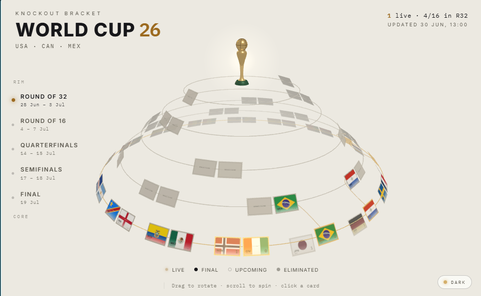

# World Cup 26 — 3D Knockout Bracket

A live, rotatable 3D knockout bracket for the 2026 World Cup. Five concentric
rings of national flags rise as a stepped cone toward a gold trophy; teams
advance one ring inward along gold beams as results come in. The whole stack
spins about a single vertical axis. Ships in light mode (with a dark "stadium
night" theme), works on mobile, and reads its entire state from one JSON file.



## Features

- **Five-ring radial bracket** — Round of 32 on the rim to the Final at the
  core, opponents grouped as tight pairs, each tie centered between its feeders.
- **Live & advancing** — live matches pulse gold; when a match goes final the
  winner's card flies inward along a drawn beam and the loser desaturates.
- **Data-driven** — the renderer hardcodes nothing; it renders whatever
  `public/bracket.json` says and re-renders when it changes.
- **Light / dark themes** (light by default, choice remembered) and a
  **responsive** mobile layout.
- **National flags only**, no FIFA marks — identity is typography and the flags.

## Built with

- **[Three.js](https://threejs.org/)** (WebGL) for the 3D scene — loaded from a
  CDN via an import map, so there's **no build step**.
- **Vanilla JavaScript** (ES modules) — no framework, no bundler.
- **Node.js** for the zero-dependency dev server and the data-update script.
- **[Inter](https://rsms.me/inter/)** + **IBM Plex Mono** (Google Fonts);
  flags from **[flagcdn.com](https://flagcdn.com)**.

## Run it

```bash
npm start    # serves at http://localhost:5173
```

Must be served over HTTP (ES modules + `fetch` are blocked on `file://`). Any
static server works; `python -m http.server` is a fine substitute.

## Data & live updates

Everything flows from `public/bracket.json`. When it changes, finished matches
automatically send their winner up a ring (along a drawn beam) and grey out the
loser — the renderer just reacts.

Updates reach the page two ways:

- **Live push (instant)** — the dev server watches the file and sends a
  server-sent event; the page refreshes in milliseconds (~200 ms measured).
- **Polling fallback** — for static hosts with no server: conditional `ETag`
  requests (unchanged polls return a bodyless `304`), faster while a match is
  live, paused while the tab is hidden.

### See it run itself

```bash
npm start        # terminal 1 — server with live push
npm run demo     # terminal 2 — simulates the tournament: matches kick off,
                 # score, finish, winners advance, losers fade. All automatic.
```

`npm run demo` needs no API key (reset anytime with
`git checkout public/bracket.json`).

### Real data

Point the update job at a provider (key stays server-side); it stamps live
scores, marks finals, and resolves advancement — only rewriting the file when
something changed:

```bash
WATCH=30 API_FOOTBALL_KEY=… LEAGUE_ID=… SEASON=2026 npm run update-bracket
```

## Deploy on Vercel (free) with live data

The site is static, so a plain Vercel import works (set the framework preset to
**Other**). Vercel can't run the always-on server or write files at runtime, so
live data comes from a scheduled job instead — included at
`.github/workflows/update-bracket.yml`:

1. Push this repo to GitHub and import it into Vercel (auto-deploys on push).
2. In the repo: **Settings → Secrets and variables → Actions**, add
   `API_FOOTBALL_KEY`, `LEAGUE_ID`, `SEASON`.

The Action then fetches results on a schedule, rewrites `public/bracket.json`
only when something changed, and pushes — which triggers a Vercel redeploy. New
scores appear within a few minutes (cron interval + deploy), all on free tiers.

> The API-FOOTBALL free tier is ~100 requests/day, so the default 15-min
> schedule is ~96/day. For fresher updates during matches, narrow the cron to
> match hours (see the comment in the workflow). The seeded results are an
> authored scenario — a real provider replaces them, so you may need to adjust
> the team/`feedsInto` mapping to the actual draw.

## Project layout

```
index.html            import map + chrome
src/scene.js          3D rings, lighting, trophy, interaction, animations
src/bracket.js        live push (SSE) + conditional polling of bracket.json
src/ui.js             header, round rail, side panel, theme toggle
src/main.js           wiring
src/flags.js          FIFA code → flag mapping
public/bracket.json   the single source of truth
serve.mjs             dev server (ETag/304 + SSE push)
update-bracket.mjs    provider fetch / demo simulator + resolves advancement
```

## Notes

- Bracket topology follows the official radial draw; each match's `feedsInto`
  encodes the tree.
- For social link previews after deploying, set an absolute `og:image` URL (and
  `og:url`) in `index.html`.
